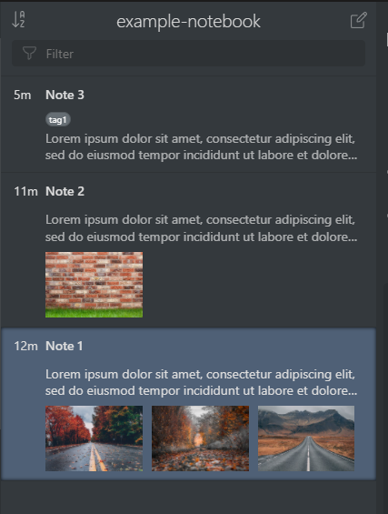

# Inkdrop Multiple Thumbnail List and Short Date Plugin

> Inkdrop plugin to show multiple thumbnail images and alter modified date format in note lists

This plugin, forked from [Fus1onDev/inkdrop-thumbnail-list](https://github.com/Fus1onDev/inkdrop-thumbnail-list) under the MIT license, was designed to show multiple images in the thumbnail preview, and alter the modified date format.

This plugin was written to make note lists appear like a Mac notetaking app, which shall remain unnamed.

Important things to note between this plugin and repo it is forked from ([Fus1onDev/inkdrop-thumbnail-list](https://github.com/Fus1onDev/inkdrop-thumbnail-list))

1. The config options were removed.  Reason being is that this plugin was written with a specific look in mind.

## Changelog